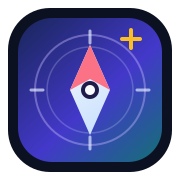
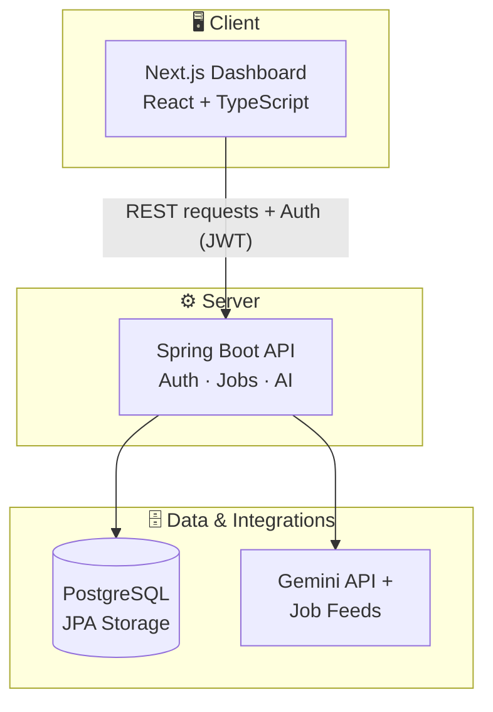

<div align="center">

<p align="center">
    <sub>CAREER OPERATING SYSTEM · AI-ASSISTED JOB SEARCH</sub>
</p>

<p align="center">
    
</p>

<h1 align="center">AI Job Hunter</h1>

<p align="center">
    <strong>Discover the right role. Build the right story. Move forward with intent.</strong>
</p>

<p align="center">
    A focused command center for the full job-search loop — from the first job signal<br />
    to a tailored application, a prepared interview, and measurable momentum.
</p>

<p align="center">
    <a href="#-quick-start">Launch locally</a>
    &nbsp; · &nbsp;
    <a href="#-capabilities">Explore capabilities</a>
    &nbsp; · &nbsp;
    <a href="https://github.com/Satya522/JOB-HUNTER">View repository</a>
</p>

<p align="center">
    
    
    
    
</p>

<p align="center">
    <em>One workspace for applications, resumes, AI tools, interviews, analytics, and follow-through.</em>
</p>

<br />

[](#-tech-stack)
[](#-tech-stack)
[](#-tech-stack)
[](#-tech-stack)

<br />

[](#-the-idea)
[](#-capabilities)
[](#-architecture)
[](#-tech-stack)
[](#-quick-start)
[](#-contributing)

<br />

[](https://github.com/Satya522/JOB-HUNTER/commits/master)
[](https://github.com/Satya522/JOB-HUNTER)
[](https://github.com/Satya522/JOB-HUNTER/stargazers)
[](https://github.com/Satya522/JOB-HUNTER/forks)
[](#-contributing)

</div>

<br />

## 📌 Table of Contents

- [The Idea](#-the-idea)
- [Capabilities](#-capabilities)
- [Product Surface](#-product-surface)
- [How the AI Loop Works](#-how-the-ai-loop-works)
- [Architecture](#-architecture)
- [Project Structure](#-project-structure)
- [Tech Stack](#-tech-stack)
- [Quick Start](#-quick-start)
- [Configuration](#-configuration)
- [Security](#-security)
- [Roadmap](#-roadmap)
- [Contributing](#-contributing)
- [License](#-license)

<br />

## 💡 The Idea

Job hunting is not one action. It is a loop of finding the right role, understanding the fit, preparing a strong application, following up, and learning from every outcome.

> **AI Job Hunter brings that entire loop into one place.** The dashboard combines an application pipeline, job feeds, resume tools, interview preparation, calendar planning, and progress signals so the next useful action is always visible.

<br />

## ⚡ Capabilities

| Area | What it does |
| --- | --- |
| 🗂️ **Application pipeline** | Track roles from applied to interview, offer, rejection, or withdrawal with a focused board view. |
| 🔍 **Job discovery** | Pull remote and external job opportunities through backend job-feed integrations. |
| 📄 **Resume workspace** | Store resumes, select a primary resume, and send resume content through the analysis flow. |
| 🤖 **AI career tools** | Generate tailored cover letters, analyze resume fit, and run structured mock interviews with Gemini. |
| 📊 **Career dashboard** | Surface KPIs, activity, application trends, status distribution, skills, salary signals, and timelines. |
| 🗓️ **Planning layer** | Organize interviews and follow-ups through an integrated calendar view. |
| 🔐 **Identity and access** | Registration, login, JWT sessions, and Firebase-backed social provider setup. |

<br />

## 🖥️ Product Surface

The dashboard is designed around repeated job-search work rather than a collection of disconnected pages:

- **Pipeline board** — for moving applications forward
- **Job feed** — for scanning and saving relevant opportunities
- **AI tools hub** — for resume analysis, cover letters, and interview practice
- **Analytics layer** — for application activity, status mix, skills, and salary context
- **Calendar and timeline** — for the commitments that turn applications into follow-through

<br />

## 🔄 How the AI Loop Works

```mermaid
flowchart LR
    A["📄 Resume + Target Role"] --> B["🔎 Resume Analysis"]
    B --> C["🎯 Skill & Fit Signals"]
    C --> D["✍️ Cover Letter"]
    D --> E["📤 Role-specific Draft"]
    E --> F["🎤 Mock Interview"]
    F --> G["📈 Practice Feedback & Next Steps"]

    style A fill:#eef2ff,stroke:#6366f1,color:#1e1b4b
    style B fill:#eef2ff,stroke:#6366f1,color:#1e1b4b
    style C fill:#ecfdf5,stroke:#16a34a,color:#052e16
    style D fill:#fdf4ff,stroke:#c026d3,color:#4a044e
    style E fill:#fdf4ff,stroke:#c026d3,color:#4a044e
    style F fill:#fff7ed,stroke:#ea580c,color:#431407
    style G fill:#fff7ed,stroke:#ea580c,color:#431407
```



AI is an accelerator inside the workflow, not a replacement for the candidate's judgment. Credentials stay on the backend and are supplied at runtime.

<br />

## 🏗️ Architecture



The **frontend** owns the responsive product surface and dashboard interactions. The **Spring Boot backend** owns authentication, persistence, job operations, resume workflows, and integrations that require protected credentials.

<br />

## 📁 Project Structure

```text
JOB-HUNTER/
├── frontend/
│   ├── app/                     # Next.js routes and server endpoints
│   ├── components/              # Dashboard, charts, layout, and UI components
│   ├── lib/                     # API client, Firebase setup, and utilities
│   ├── store/                   # Client authentication state
│   └── types/                   # Shared frontend types
├── backend/
│   ├── src/main/java/           # Controllers, services, entities, security
│   └── src/main/resources/      # Spring configuration and schema
├── database/
│   ├── schema.sql               # Database structure
│   └── seed.sql                 # Development seed data
├── .gitignore                   # Local secrets and generated files
└── README.md
```

<br />

## 🛠️ Tech Stack

<div align="center">


</div>

| Layer | Technology | Role |
| --- | --- | --- |
| **Web application** | Next.js, React, TypeScript | App routing, UI, and client workflows |
| **Design system** | Tailwind CSS | Responsive dashboard styling |
| **API** | Spring Boot, Java | Business logic and REST endpoints |
| **Persistence** | Spring Data JPA, PostgreSQL | Users, resumes, applications, and AI records |
| **Authentication** | JWT, Firebase Auth providers | Session and identity flows |
| **AI services** | Google Gemini API | Resume analysis, cover letters, and mock interviews |
| **Visualization** | Recharts, Nivo, custom components | Activity, pipeline, skills, and salary insights |

<br />

## 🚀 Quick Start

### Prerequisites

| Requirement | Version |
| --- | --- |
| Node.js | 18+ |
| npm | Latest stable |
| Java | 17+ |
| Maven | Latest stable |
| PostgreSQL | 14+ recommended |

### 1️⃣ Clone the project

```bash
git clone https://github.com/Satya522/JOB-HUNTER.git
cd JOB-HUNTER
```

### 2️⃣ Start the backend

Create your local environment variables first, then run:

```bash
cd backend
mvn spring-boot:run
```

The API starts at **`http://localhost:8080`**.

### 3️⃣ Start the frontend

In a second terminal:

```bash
cd frontend
npm install
npm run dev
```

Open **`http://localhost:3000`** in your browser.

<br />

## ⚙️ Configuration

The backend reads protected values from environment variables — nothing sensitive should be hardcoded.

| Variable | Used for |
| --- | --- |
| `DB_HOST`, `DB_PORT`, `DB_NAME` | PostgreSQL connection |
| `DB_USERNAME`, `DB_PASSWORD` | Database credentials |
| `JWT_SECRET` | Signing authenticated sessions |
| `GEMINI_API_KEY` | AI career tools |
| `ADZUNA_APP_ID`, `ADZUNA_API_KEY` | Adzuna job feed |
| `THE_MUSE_API_KEY` | The Muse job feed |
| `MAIL_HOST`, `MAIL_USERNAME`, `MAIL_PASSWORD` | Optional email delivery |
| `CORS_ALLOWED_ORIGINS` | Allowed frontend origins |

> Keep local values in an environment file or shell configuration. **Never** commit credentials, uploaded resumes, generated build output, or dependency directories.

<br />

## 🔒 Security

- ✅ Secrets are resolved at runtime through environment variables.
- ✅ Local `.env` files, build output, dependencies, logs, and IDE metadata are `.gitignore`d.
- ✅ The browser Firebase config is client-side configuration only — server credentials remain backend-only.
- ✅ Use a strong, unique `JWT_SECRET` outside local development.

<br />

## 🗺️ Roadmap

- [ ] Richer application reminders and follow-up automation
- [ ] Expanded job-feed normalization and duplicate detection
- [ ] Deeper resume-to-role comparison insights
- [ ] Improved interview feedback history and progress tracking
- [ ] Deployment documentation for production environments

<br />

## 🤝 Contributing

1. **Fork** the repository and create a focused branch.
2. Keep secrets and generated files **out of commits**.
3. Run the relevant frontend or backend checks before opening a pull request.
4. Explain the **user workflow** affected by your change in the PR description.

<br />

## 📄 License

This project is currently maintained as a **personal portfolio and product-development project**. A formal license will be added before it is distributed as an open-source package.

<br />

<div align="center">
  Built with focus by **[Satya522](https://github.com/Satya522)**

  ⭐ If this project is useful, consider starring the repo!
</div>